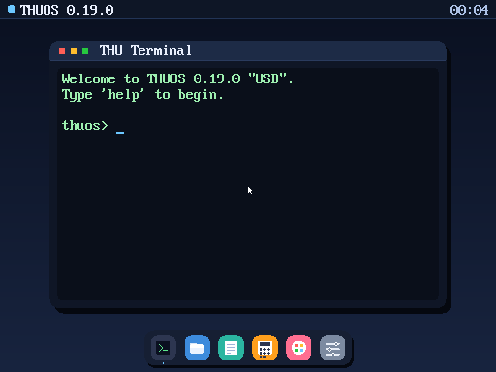
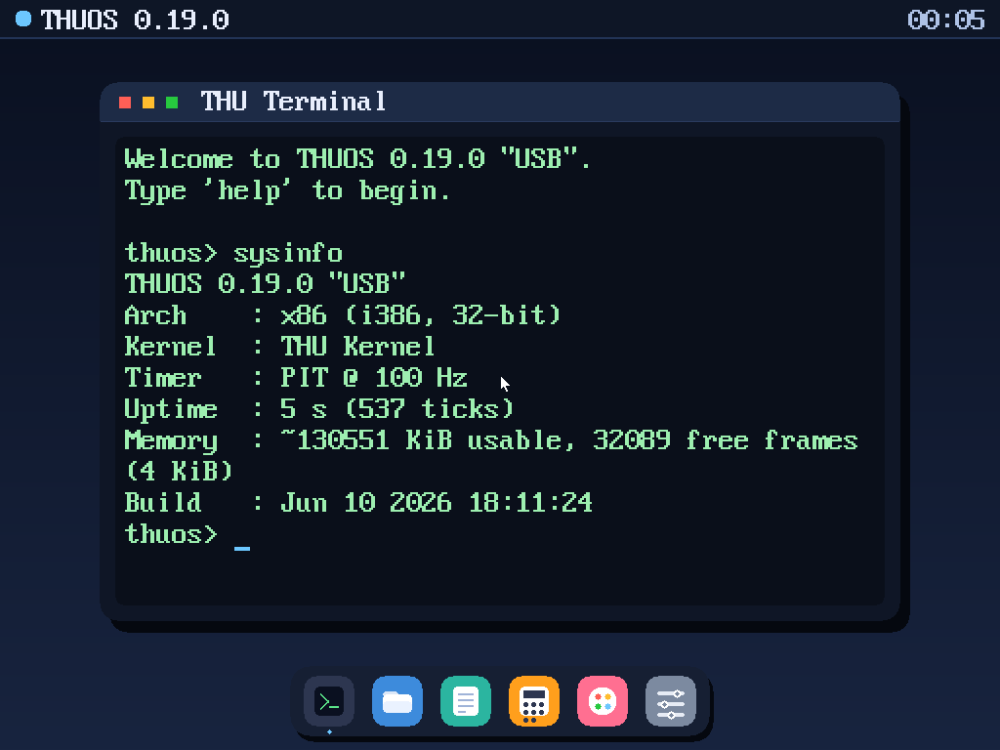
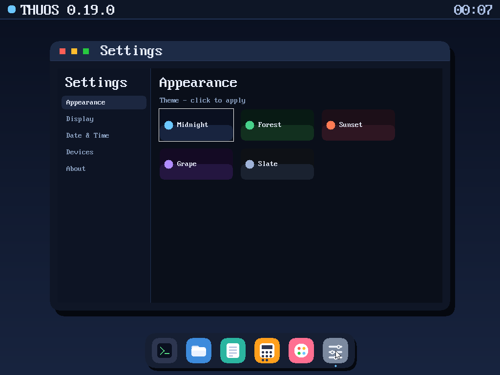
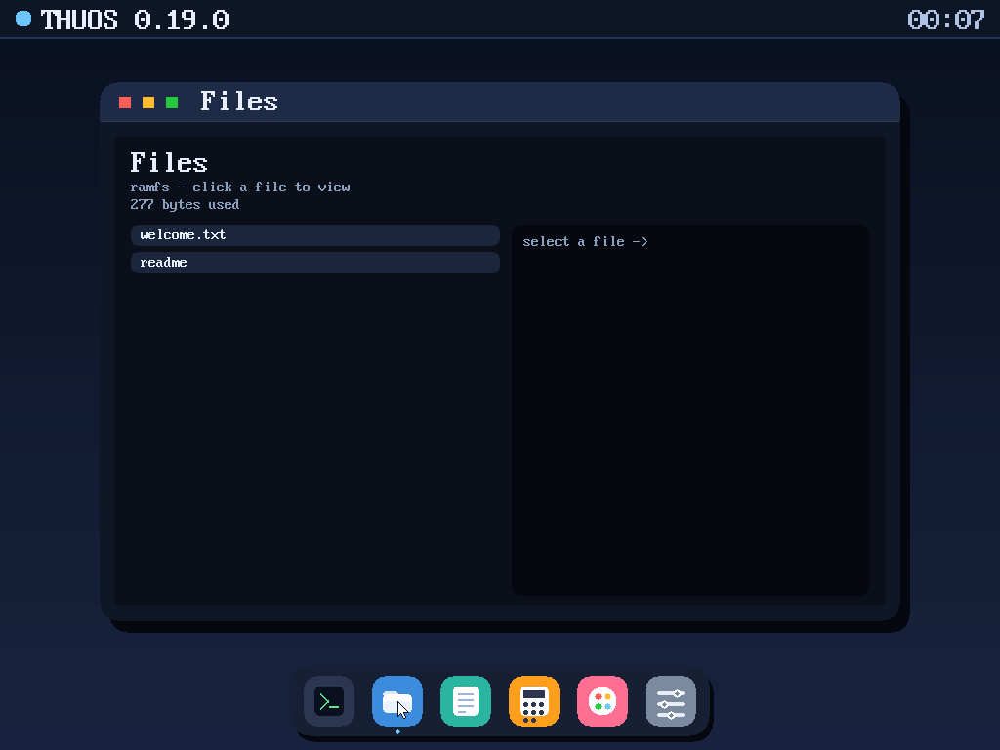
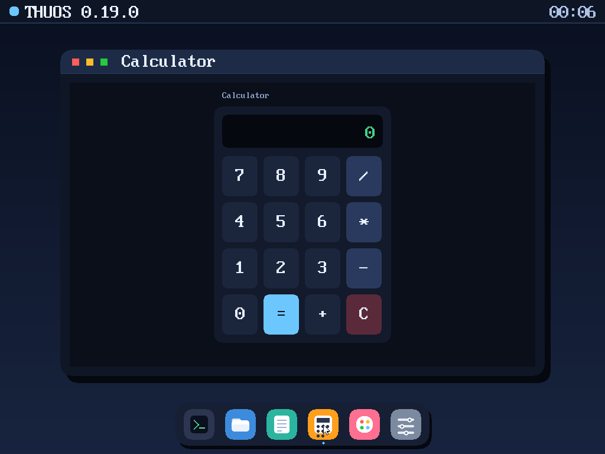
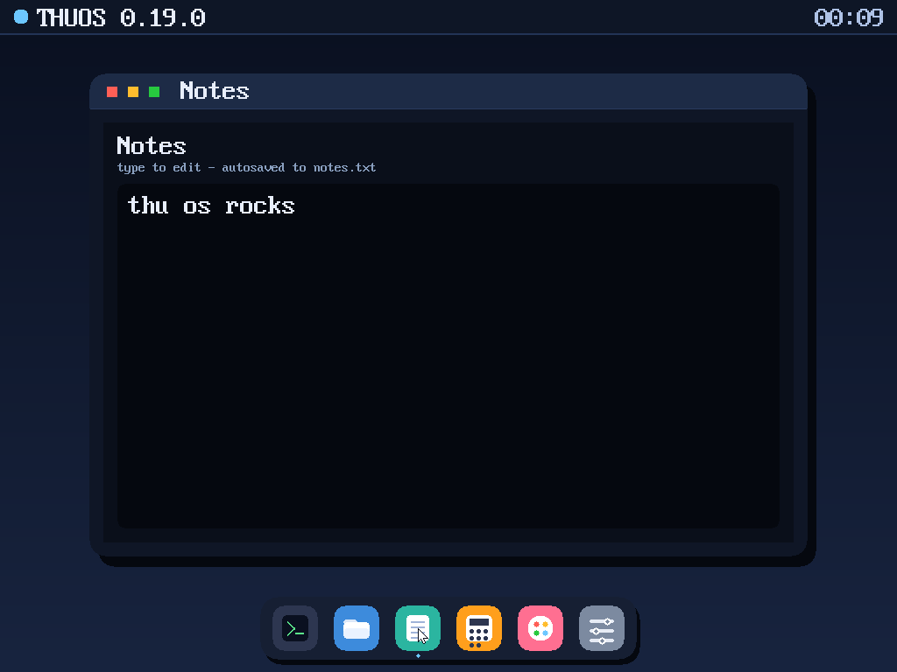
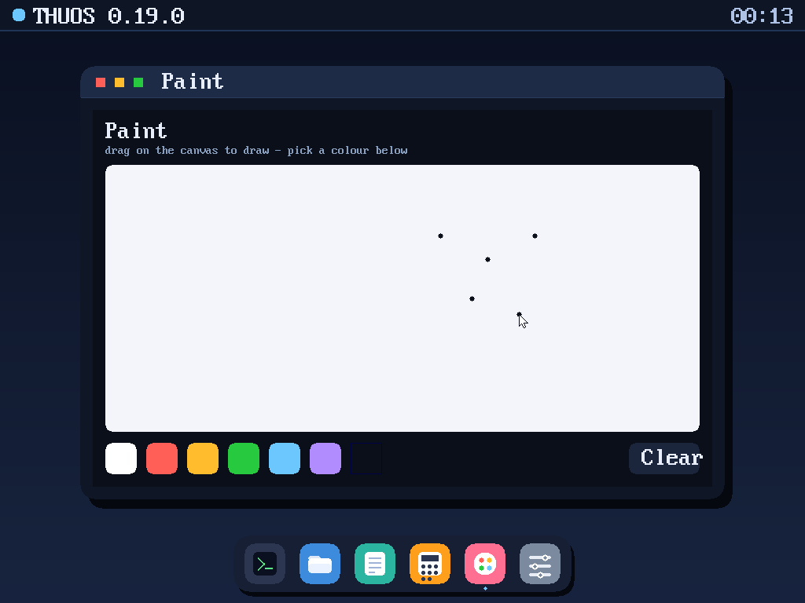

# THUOS — Version Archive

**A frozen, dated archive of every released version of THUOS** — one folder per release.

 
The latest release — <b>0.19.0 "USB"</b> — running in QEMU (real screenshot).

This `master` branch is a **version museum**: one top-level folder per release
(`THUOS 0.2.0` … `THUOS 0.19.0`), each a faithful snapshot of the source tree at
that version, taken from git history.

- The latest, live, **buildable** kernel is on **[`main`](../../tree/main)** — build and run from there.
- This branch is for **browsing history**; it is not built by CI.
- The **Date** column is each release's date (matching its `CHANGELOG.md`). New
  releases are appended here with their date as they ship.

## Release history

| Version | Codename | Date | What it added |
|---------|----------|------|---------------|
| THUOS 0.2.0  | Boot Seed         | 2026-06-05 | Multiboot boot, VGA text, serial, GDT/IDT, exceptions, PIC/IRQ, PIT, keyboard, shell |
| THUOS 0.3.0  | Memory Foundation | 2026-06-05 | Physical memory manager (4 KiB frame bitmap) |
| THUOS 0.4.0  | Kernel Heap       | 2026-06-06 | `kmalloc`/`kfree` over a free-list arena |
| THUOS 0.5.0  | Paging            | 2026-06-06 | x86 page tables + address translation (staged) |
| THUOS 0.6.0  | Scheduler         | 2026-06-06 | Round-robin scheduler policy core |
| THUOS 0.6.1  | Boot-Verified     | 2026-06-06 | First real QEMU boot smoke-test in CI |
| THUOS 0.7.0  | Virtual Memory    | 2026-06-06 | Paging ENABLED (CR0.PG) |
| THUOS 0.8.0  | Context Switch    | 2026-06-06 | Cooperative context switch |
| THUOS 0.9.0  | Cooperative Tasks | 2026-06-06 | Multitasking via scheduler + context switch |
| THUOS 0.10.0 | Filesystem        | 2026-06-06 | In-RAM filesystem (`ls`/`cat`/`write`) |
| THUOS 0.11.0 | Syscalls          | 2026-06-06 | `int 0x80` syscall ABI |
| THUOS 0.12.0 | User Mode         | 2026-06-09 | Ring 3: TSS + `iret` to CPL 3 + `int 0x80` from userspace |
| THUOS 0.13.0 | Desktop           | 2026-06-09 | VGA graphics (mode 13h) + the THU Desktop + graphical terminal |
| THUOS 0.14.0 | Aurora            | 2026-06-09 | High-res truecolor desktop (1024×768×32 via Bochs VBE) |
| THUOS 0.15.0 | Apps              | 2026-06-09 | PS/2 mouse + clickable dock + apps (Terminal/Calculator/Files/System/About) |
| THUOS 0.16.0 | Polish            | 2026-06-09 | Pictogram app icons, top-bar clock, active-app indicator |
| THUOS 0.17.0 | Suite             | 2026-06-09 | Settings menu (live themes) + Notes + Paint |
| THUOS 0.18.0 | Portable          | 2026-06-10 | Bootloader-provided framebuffer (GRUB Multiboot / UEFI GOP) + embedded font → graphics on real Intel/AMD hardware |
| THUOS 0.19.0 | USB               | 2026-06-10 | xHCI host controller + USB-HID boot keyboard & mouse → input on real laptops (no PS/2 needed) |

> There is no `v0.1` source — `0.2.0 "Boot Seed"` is the first bootable kernel.
> Full per-release notes live in `CHANGELOG.md` inside any snapshot
> (e.g. `THUOS 0.19.0/CHANGELOG.md`).

## The latest release in pictures

Real screenshots of `THUOS 0.19.0` running in QEMU:

<table>
<tr>
<td align="center" width="50%"> <b>Terminal</b> — the <code>thuos&gt;</code> shell</td>
<td align="center" width="50%"> <b>Settings</b> — live themes</td>
</tr>
<tr>
<td align="center"> <b>Files</b> — in-RAM filesystem</td>
<td align="center"> <b>Calculator</b></td>
</tr>
<tr>
<td align="center"> <b>Notes</b> — typed via the USB keyboard</td>
<td align="center"> <b>Paint</b> — drawn with the USB mouse</td>
</tr>
</table>
